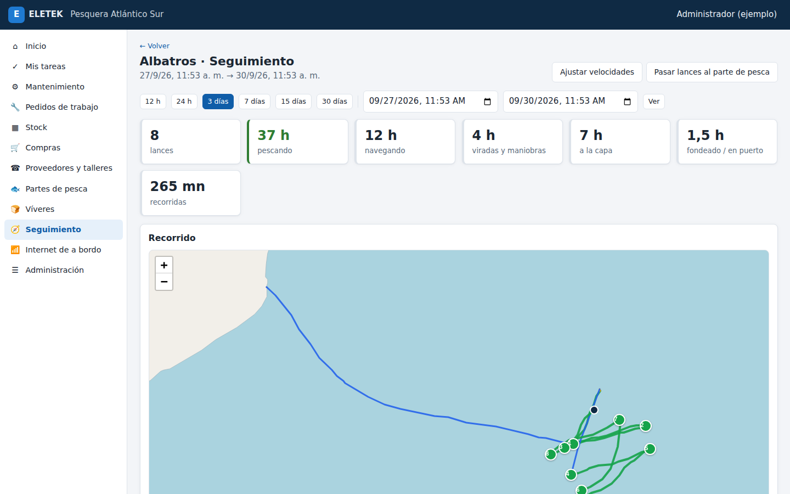
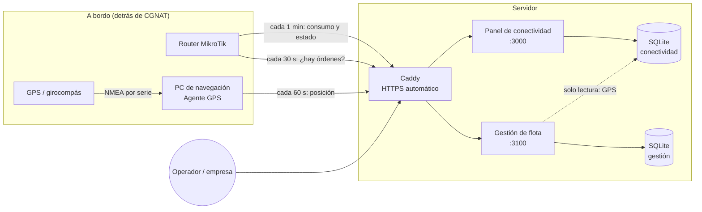
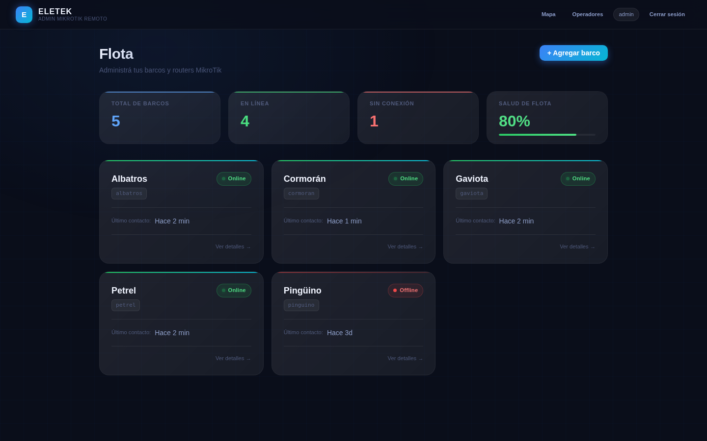
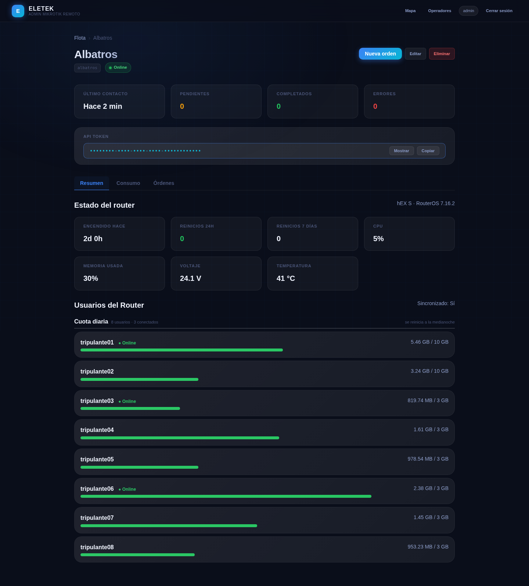
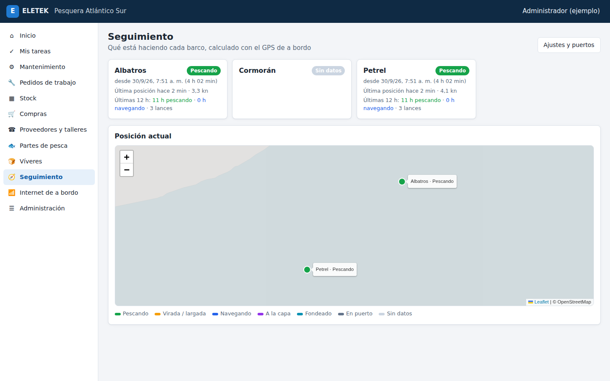
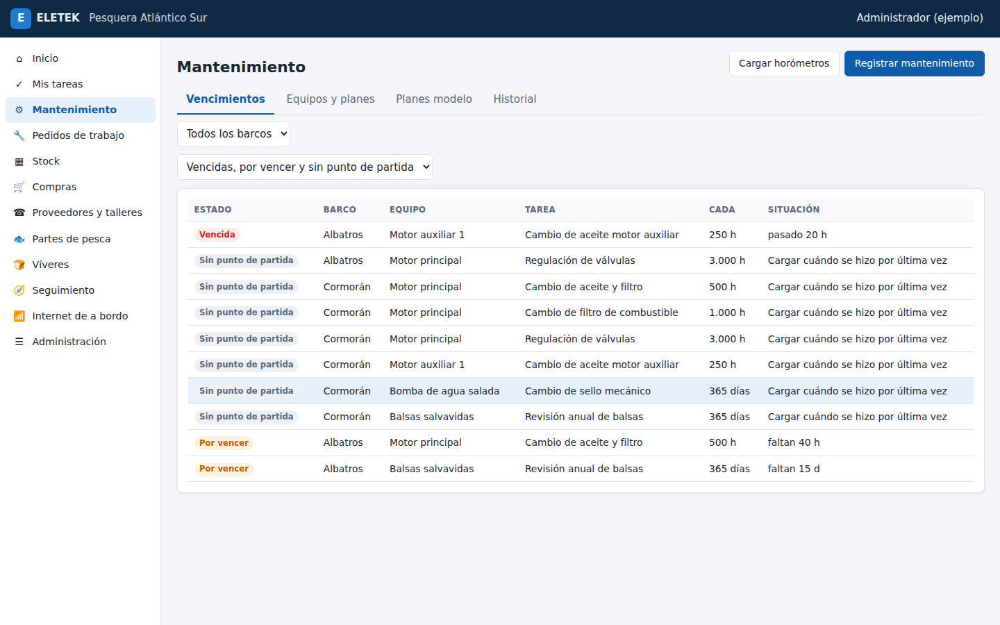
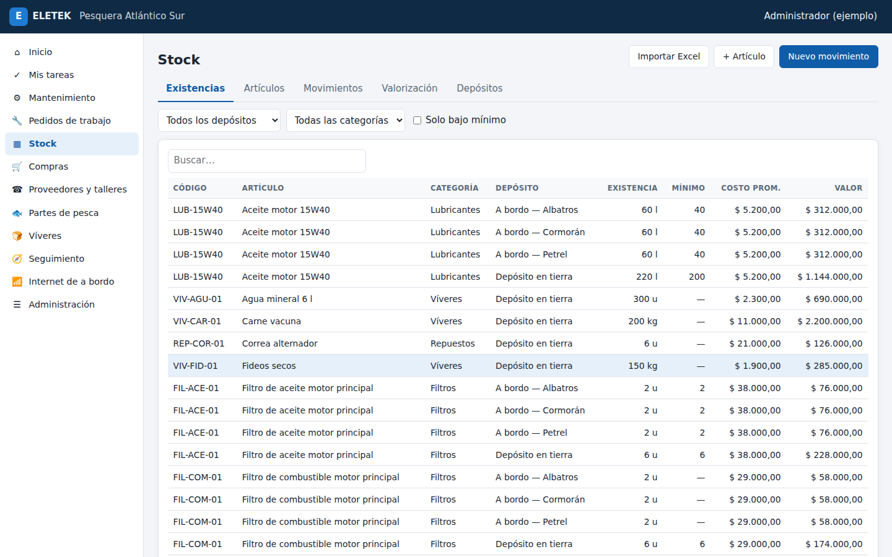
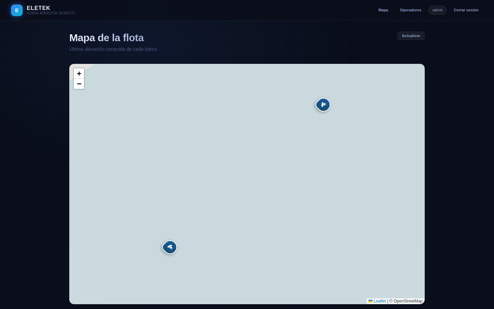

# ELETEK · Plataforma de gestión para flotas pesqueras

Sistema que uso en producción para administrar la conectividad, la ubicación y
la operación de barcos pesqueros de Mar del Plata. Tiene tres partes:

| Parte | Qué hace | Tecnología |
|---|---|---|
| [**Conectividad**](conectividad/) | Administra a distancia los routers MikroTik de cada barco: usuarios de internet de la tripulación, cuotas, consumo, salud del router y órdenes remotas. | Node.js · Express · SQLite · RouterOS scripting |
| [**Agente GPS**](conectividad/agente-gps/) | Programa para la PC de navegación. Lee el GPS o el girocompás por puerto serie (NMEA 0183) y reporta posición, velocidad y rumbo. | C# · .NET Framework 4 · WinForms |
| [**Gestión de flota**](gestion/) | ERP por módulos para la empresa armadora: stock, mantenimiento preventivo, pedidos de trabajo, compras, partes de pesca, víveres y seguimiento de actividad por GPS. | Node.js · Express · SQLite · JS sin framework |

> Los nombres de la empresa, los barcos y todos los datos de este repositorio
> son de **demostración**. Los datos reales de clientes no se publican.



---

## El problema

Un barco pesquero pasa semanas en el mar con internet satelital (Starlink).
El router de a bordo queda detrás de **CGNAT**: no tiene IP pública, así que
desde tierra no hay forma de conectarse a él para crear un usuario, cambiar
una cuota o ver qué está pasando.

La solución invierte la conexión: **el router llama al servidor**, no al revés.



- **Telemetría** (`eletek_sync`, cada minuto): cada usuario del hotspot con
  bytes, cupo y si está conectado, más CPU, memoria, voltaje, temperatura y
  uptime del router. Con el uptime se detectan reinicios, que delatan fuentes
  flojas o falsos contactos.
- **Órdenes** (`eletek_poll`, cada 30 s): el router pregunta si hay algo
  pendiente. El panel traduce la orden ("crear usuario con 3 GB") a un script
  de RouterOS **validado contra inyección de comandos**, el router lo ejecuta
  y devuelve el resultado.

## Capturas

| Panel de conectividad | Detalle de un barco |
|---|---|
|  |  |

| Gestión: seguimiento de la flota | Gestión: mantenimiento |
|---|---|
|  |  |

| Gestión: stock | Mapa de la flota |
|---|---|
|  |  |

---

## Decisiones técnicas que vale la pena contar

**Clasificación de actividad a partir del GPS.** Con un punto por minuto
(velocidad y rumbo), el sistema reconstruye qué hizo el barco: *navegando,
pescando, virada, a la capa, fondeado, en puerto*. La velocidad se suaviza con
una mediana móvil para filtrar los saltos del GPS. Después cada punto se
clasifica por franjas y los tramos cortos se absorben en sus vecinos. Por
último, cada tramo se etiqueta según su contexto: lo lento entre dos lances es
una virada, no una parada. Lo calibré con recorridos reales de arrastreros:
lances de 4 a 5 h a unos 4 nudos, viradas de 30 a 50 min. Los umbrales se
ajustan por barco, porque un potero pesca casi quieto. Los lances detectados
se pueden pasar al parte de pesca con hora y posición.
→ [`gestion/src/servicios/actividad.js`](gestion/src/servicios/actividad.js)

**Un bug de producción: el servidor "se tildaba" una vez por día.** El panel
usaba `sql.js` (SQLite compilado a WebAssembly, en memoria), que reescribía el
archivo entero en cada guardado. Con la flota reportando miles de veces por
día, la memoria WASM terminaba corrupta (`memory access out of bounds`). Lo
migré a `node:sqlite`, que escribe directo al archivo. Sumé un control de salud
que reinicia el proceso si la base deja de responder y un script que lo vuelve
a levantar solo.
→ [`conectividad/src/db/database.js`](conectividad/src/db/database.js)

**Multiempresa y permisos que se aplican en el acto.** Cada consulta filtra
por la empresa de la sesión, y un recurso de otra empresa responde 404 (no
403, para no confirmar que existe). Los permisos se leen de la base en cada
petición, no de la sesión: dar de baja a alguien tiene efecto inmediato. Cada
petición pasa tres controles: módulo incluido en el plan, acción permitida
por el rol y barco dentro del alcance del usuario.
→ [`gestion/src/middleware/auth.js`](gestion/src/middleware/auth.js)

**El stock no se edita: se mueve.** La existencia es la suma de movimientos
(entradas, transferencias, consumos, ajustes con motivo), con costo promedio
ponderado. Los movimientos de varios artículos van en una transacción: un
consumo de cinco repuestos no puede quedar grabado a medias.
→ [`gestion/src/servicios/stock.js`](gestion/src/servicios/stock.js)

**Mantenimiento por horas, días o mareas.** Una tarea vence por lo primero que
se cumpla. El "último hecho" se guarda por equipo, así un plan modelo
compartido lleva la cuenta de cada motor por separado. Los planes se pueden
*copiar* (independientes) o *igualar* (un cambio se aplica a todos los barcos).
→ [`gestion/src/servicios/mantenimiento.js`](gestion/src/servicios/mantenimiento.js)

**Agente GPS compatible con PCs viejas.** Las PCs de navegación suelen tener
Windows 7 sin actualizar. El agente es un solo `.exe` de 26 KB sobre .NET 4.0,
sin instalador. Incluye un diagnóstico de red (DNS, TCP, TLS 1.2) para
resolver problemas por teléfono con la tripulación.
→ [`conectividad/agente-gps/`](conectividad/agente-gps/)

**Frontend sin framework.** Las dos interfaces son SPAs en JavaScript puro,
pensadas también para el celular a bordo. En la gestión todo el DOM se arma
con una función `h()` que usa `textContent`, nunca `innerHTML` con datos del
usuario.

## Stack

Node.js 22 (`node:sqlite`) · Express · SQLite · JavaScript sin framework ·
Leaflet · Chart.js · C# / .NET Framework 4 · MikroTik RouterOS scripting ·
Caddy (HTTPS automático con Let's Encrypt) · DuckDNS

## Probar la demo

Requiere **Node.js 22.13 o más nuevo**.

```bash
# 1. Panel de conectividad, con barcos, consumos y recorridos inventados
cd conectividad
npm install
cp .env.example .env        # completar SESSION_SECRET y ADMIN_PASS
npm run demo
npm start                   # http://localhost:3000

# 2. Gestión de flota (en otra terminal)
cd gestion
npm install
cp .env.example .env        # completar SESSION_SECRET y SUPER_PASS
npm run semilla             # empresa de ejemplo; usuario demo.admin / ejemplo2026
npm start                   # http://localhost:3100
```

El `.env.example` de la gestión ya apunta a la base de la demo de
conectividad, así el módulo de Seguimiento muestra los recorridos simulados.

## Estado

En producción: el panel de conectividad gestiona los routers de una flota de
barcos pesqueros de Mar del Plata. La gestión de flota está en
implementación con el primer cliente.

---

Desarrollado por **Facundo Parodi** · [ELETEK](https://www.instagram.com/eletek.digital/), Mar del Plata, Argentina.

El código se publica como portfolio. Todos los derechos reservados.
